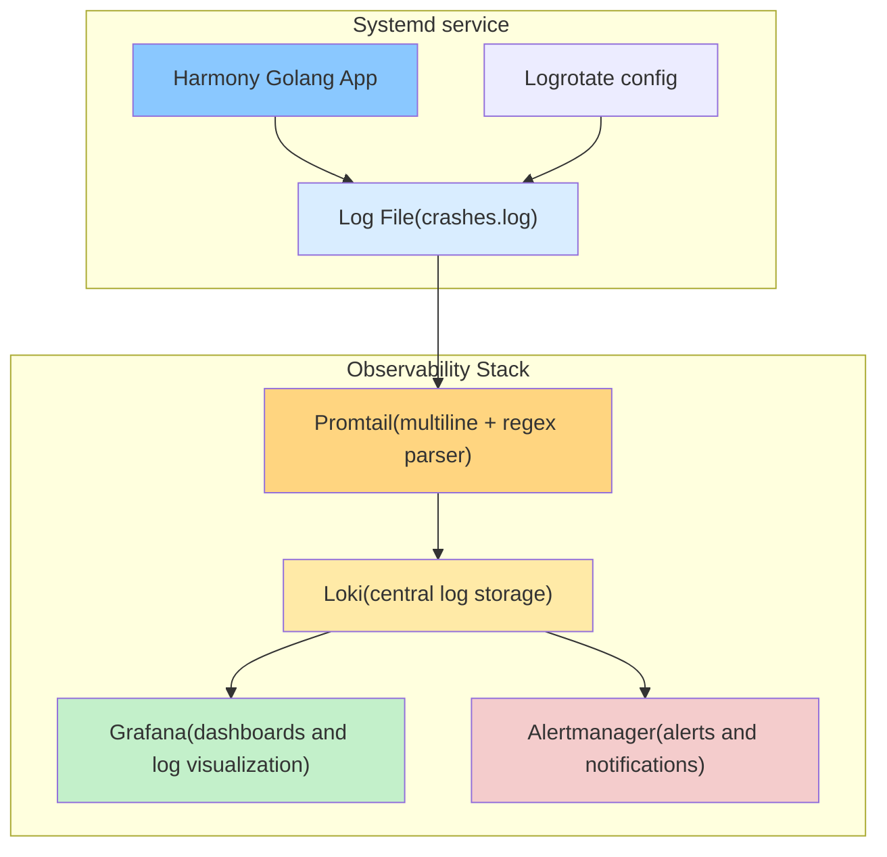
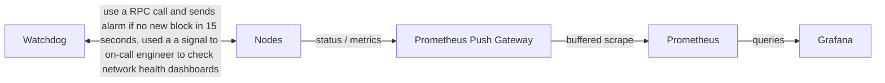

2025-11-14 Fri:

Main focus on the week was the Teleport proxy upgrade to the LTS version, fixes for the Ansible code around it, hardening its setup. Everything was successfully finished, new versions monitor was setup and already catch one fresh release. Only internal documentation update left here.

For the support activities, I've created a shared snapDB with community.

Additionally, I've updated Base node setup to return more eth_getLogs results, found one issue in the original repo and upgraded the Reth node.

---

2025-11-07 Fri:

First of all, I was helping Gheis with the [trusted nodes concept](https://github.com/harmony-one/harmony/pull/4962) testing on the devnet. I've created a few new panels from my side to visualize how trusted nodes are used both on the libp2p and stream levels through both shards.

For the support activities, I've created a fresh snapDB and shared [snapDB creation guide](https://docs.harmony.one/home/network/validators/node-setup/5.-advanced-how-to-create-snapdb-on-your-server) with community.

And finally for the Base node, I've upgraded nodes the whole chain L1 Erigon and Lighthouse for the Fusaka hardfork on Ethereum, and for the Base Reth for the Jovian optimism hardfork.

---

2025-10-31 Fri:

First of all, I've finished the collect crashes feature for our logging system, it is live now in devnet, testnet, mainnet networks.

For the support activities, created a snapDB creation guide for the community and will publish it after fixing a few comments from the validators.
For the stream sync and trusted node feature I've recommended Ghies to use the [dnsaddr](https://github.com/libp2p/specs/blob/master/addressing/README.md#dnsaddr-links) libp2p feature like we are using in the bootnodes and created two TXT dns records for this - `_dnsaddr.trusted.s0.ps.hmny.io`,`_dnsaddr.trusted.s1.ps.hmny.io`.

And finally for the Base node, I've created a runbook covering all usage scenarios, updates and gotchas for this infra part. Additionally, I've enabled the Flashblocks RPC on it by request from the team. Previous week versions monitoring setup already helped me to catch 3 Base RPC updates and do it right on time.

---

2025-10-24 Fri:

During the collect crashes review in the testnet, I've noticed that not all systemd services can append to the file, checked other possibilities here and found that promtail can parse the journal directly thus rewritten my solution accordingly and rollout it to the devnet.

For the support activities, I was helping Gheis with a fresh bundle of stream sync features and installed Kostnantin's `replace ducktape with goja` PR version to the testnet RPC.

Additionally, I've noticed that tests for [goja PR](https://github.com/harmony-one/harmony/pull/4958) weren't running due to travis CI condition waiting for dev/main branches as a base - fixed [this](https://github.com/harmony-one/harmony/blob/d7c1d03739a7207a93fda5693e8860c6d9009bac/.travis.yml#L21-L23).

And finally, I was checking that our Base RPC started to have strange errors in logs with `environment map size limit reached`. I've read the reth documentation, found that this size should automatically adjust, restarted the whole server. After restart Base Reth wasn't able to communicate with the op-reth, so I've decided to check which versions we are running here for Erigon/Lighthouse and base/node Reth and they were a bit outdated. The full versions update helped to sync the base Reth node again. As a a good practice, I've added newreleases.io bot to send us notification about new releases for this stack.

---

2025-10-17 Fri:

My main focus was on implementing all changes needed to collect crashes from systemd service to the promtail parsing and Loki collection. Solution tested and rolled out to the devnet and testnet nodes. You can see what it looks like as a dashboard on the screenshot below

Additionally, helped Gheis with testing new improvements for the stream sync, found an issue with sync on new code, reported finding to Gheis. I've rechecked the fix and rolled it out to the devnet and testnet.

And finally as an on-call engineer was checking the strange issue on the testnet RPC for shard 0 - out of blue moon server's 8 CPU's were doing only iowait time to time, first idea was issue with harmony node, but all other nodes with same version were good. So I've asked provider support to check on their side and it was a noisy neighbor issue - some other virtual machine was eating all the IOPS, the fix was to move our vm to another qemu host which is not so crowded.

In addition, this issue gives 2 problems with noisy alarms in the watchdog when we send too many `node stuck` alarms in Pagerduty and hit the rate limit. I've fixed one of them to double the rate limit, the other one about the alarm condition is in low priority due to mitigation of rate limit + fixing the issue source.

---

2025-10-10 Fri:

As an on-call engineer, I was digging an issue with trace RPC methods for `update to Berlin and London eth fork` in the testnet together with Konstantin, tried to use build with race detection, checked how this was fixed in the geth repo. Geth switched to another solution for the javascript engine - [goja](https://github.com/dop251/goja).

Additionally, I've shared my feedback about testnet RPC nodes with enabled stream sync to the Gheis - time to time is going far away behind the network.

Speaking about the systems engineering part, issues with trace RPC methods have given a good insight about our log aggregation infra - we aren't collecting the crash logs, because they are going to the stderr and syslog by default. So I've created a user story to fix this and started to work on it. You can see my solution on the mermaid diagram below:

---

2025-10-03 Fri:

For 3 days this week I focused on the new type task - cost check, found the room to save on unused items and shared my findings with management.

Additionally, as an on-call engineer, I found the issue with trace RPC methods for `update to Berlin and London eth fork` in the testnet, rolled back version to stable, gathered information and shared it with Konstantin.

And finally, I've ordered 15 TB NVMe disk for the Base Reth RPC to solve issue with running out of space.

---

2025-10-01 Wed - sick day

2025-09-30 Tue - sick day

---

2025 Q4 plans:
1. Review the current infrastructure and costs, because now I'm the only one in charge for this.
2. Improve our observability stack - review and fix our current setup and add new metrics and tools.
3. Together with team prepare to stream sync alpha release in the mainnet.

---

2025 Q3 Review:

My main focus was stream sync. I deployed new versions on devnet/testnet, debugged database and crosslink issues, and worked with Gheis on fixes that eventually landed in merged PRs. To make issues visible, I built detailed visualizations: real-time dashboards for stream sync health and crosslink messages. These gave the team clear visibility into synchronization behavior and helped validate improvements after each release.

In parallel, I broadened my operational experience: setting up and maintaining devnet/testnet infrastructure, learning how to support a Base archival RPC node with reth, and improving disk and server management for Erigon/Lighthouse.

---

2025-09-26 Fri:

This week's main focus was on creating new servers for the devnet, because old ones were running out of space. Additional disks will be the same in money terms thus I've chosen this way. Regular tasks started to be challenging, because of Ansible/python versions conflicts between current devops server and new Ubuntu 24. I was able to deal with all issues and record what to fix next.

Stream sync and `update to Berlin and London eth forks` changes were deployed both on devnet and testnet. Stream sync had brought to us new issues with database errors and crosslink processing - data collected and reported to Gheis.

On the Aerodrome Subgraph, I've removed the previous pool factory subgraph, pinged Yuri to give me a changed version with only needed pools.
We are still struggling on the disk space on this node, thus I'll order more NVMEs on the following week and migrate erigon/lighthouse to the new RAID0.

---

2025-09-13 till 2025-09-22: Paid Time Off

---

2025-09-12 Fri:

This week main focus was the help for Gheis with new versions of the Stream Sync. What I found and reported to Gheis on new versions - database errors,
highlighted that crosslinks now are working differ from previous version. Result: we successfully merged all the work on the [PR-4943](https://github.com/harmony-one/harmony/pull/4943). You can see how crosslinks are processed ongoing like in mainnet vs start of each epoch(on the left):

I've also installed the Konstantin's version with the London and Berlin upgrades on the devnet - [PR-4915](https://github.com/harmony-one/harmony/pull/4915).

Additionally, I've checked our codebase for the recent npm hack and alarmed our application dev team, more [details](https://discord.com/channels/532383335348043777/836542225809801246/1415202933775274045). Thanks for Aaron for initial findings.

On the Aerodrome Subgraph, I've found that we are indexing the PoolFactory contract or all 2.2K of smart-contracts created from it instead of a few really needed. I've paused the Subgraph indexing and notified application dev team.

---

2025-09-05 Fri:

This week main focus was the help for Gheis with the new version of the Stream Sync, I've installed it on the devnet and testnet, found issue with crosslink processing collected initial findings and share with Gheis.

Additionally, I've created a dashboard based on the hmy_p2p_crosslink_msg metric to have the real time understanding what it is happening on the network level, additionally added link to it from the watchdog tool:

On the ops side, I've created a quick solution for the top-level `.country` domains and reported issues to the Aaron, all of them were fixed.

On the Aerodrome Subgraph, it is still syncing on the 50% of all block, finished final steps in the setup and moved lighthouse db to the other disk to give subgraph some space on the disk.

---

2025-08-29 Fri:

This week focus was on the ops side completely. I've finished to sync up the Base Archival RPC node, started to collect metrics and added monitoring dashboards for all 3 blockchain clients - lighthouse, erigon and reth, shared endpoint with the Harmony team.

The second task was to start index the [Aerodrome Subgraph](https://github.com/metastable-labs/subgraph) via the Graph indexer. I've setup the whole infrastructure needed - Postgres SQL, IPFS and graph nodes. Aerodrome Subgraph is indexing for now.

---

2025-08-22 Fri:

This week focus was on the ops side completely. I have enabled stream sync clients on the testnet and most of the nodes were able to sync with the network. All instabilities were reported to Gheis.

Additionally, I've moved [Harmony faucet](https://github.com/mur-me/h/tree/main) to the harmony org, created [new domain faucet.hmny.io](https://faucet.hmny.io/), added redirect from the old [one - faucet.pops.one](https://faucet.pops.one/), changed uptime robot monitors, rewrite documentation both internal and external for it.

And finally, I've gotten a request from the development team to spin up an archival Base RPC node. I've analyzed server and application requirements and disks size, chosen the server provider, fully setup the whole server - firewalls, our monitoring stack. Right now, I'm downloading and extract snapshots for the Base reth, eth lighthouse and eth erigon.

---

2025-08-15 Fri - Paid Time Off

---

2025-08-14 Thu:

This week focus was the help for the team with the stream sync:

For the testnet - it is enabled as server only with further clients enabled on the following week. Monitoring is setup and running for the whole network, all nodes added more or equal than 3 streams each, which means we are in good pace now.

For the devnet- we had 2 instabilities due to issues on the cloud provider side where devnet shard was split in 2 networks one on the N block, the other one on the block N+1. Reason - 45% of sign power was isolated in one cloud provider, when the other 55% were able to communicate to each other. I've checked that stream sync wasn't the root cause of the issue, after restart all the nodes on N block were able to sync the N+1 block.

Additionally, I've highlighted to Ghies one problematic RPC which stops to sync with the network and Ghies is analyzing the root cause of this issue.

For the ops tasks, I've helped Sun to review the current resource usage in AWS and suggested what server can be downgraded by resources and what can be deleted.

For the monitoring area, I've improved our dashboard for the RPC metrics with 2 new filters - `instance` and `method`. We need this to clearly understand what kind of request our RPC serves. Additionally, I've covered all 5 RPC endpoints with an uptime robot check for the node sync, previously we didn't have it on each node level. It will help us to understand how Harmony RPC nodes are serving traffic to users.

---

2025-08-08 Fri:

This week I was mostly focused on helping consensus team with the stream sync stabilization - installed several updates, reviewed PRs,updated the monitoring dashboard, debug issue with wrong peer_ids on the /dnsaddr/bootstrap.ps.hmny.io. We have ended up with [the first stable version](https://github.com/harmony-one/harmony/releases/tag/stream_sync_v1_stable_devnet) for the devnet fully running on stream sync since Monday.

Additionally, I've finished testing multiplexor update - from mplex 0.7.0 and yamux to yamux and mplex 6.7.0, tests have shown that transition period for the network should be fine, because we will use one common multiplexor - yamux.

And finally, I've started preparation for the stream sync in the testnet - enabled app metrics monitoring for it for having the bird eye view on how will it behave.

---

2025-08-01 Fri - Paid Time Off

---

2025-07-31 Thu:

This week focus was completely on the house-keeping tasks.

On the consensus development side, I've fixed the pyhmy negative tests [PR-44](https://github.com/harmony-one/pyhmy/pull/44), they started to fail by timeout or run for 40 minutes instead of 12-15. Root cause - example.com domain started to throttle bad requests, fix was to point negative tests to domain under our control.

On the support side, fix [faucet](https://faucet.pops.one/) links to the Harmony discord instead of pops tg chat.
Additionally, helped Blockscout team to investigate 429 rate limit issue on the explorer - ended up L2PASS project was sending the same 20 API requests per seconds, eating all default Blockscout rate limit. I've tried to connect with L2PASS - no luck, their discord is read only. Blockscout team at the same time just rate-limited L2PASS project on the blockscout.

And finally I've documented all the findings about 2 additional options to sync our archival nodes with others- rclone+rsync deltas and parsyncfp2 if do it from scratch.

---

2025-07-25 Fri:

On the monitoring side, I've created simple counters dashboard to monitor setModes in the mainnet validator logs. Current idea - collect data.

On the consensus development side, I've create a command to add nodes to already running localnet, [PR-4928](https://github.com/harmony-one/harmony/pull/4928). It should help to test stream sync locally with less manual tweaks.

On the ops side, Pocket network partner asked for help with archival RPC node sync, because rclone wasn't able to properly finish the sync, despite the fact that it synced 23 TB. I've ended up checking all possible solutions around like https://github.com/hjmangalam/parsyncfp2 - parallel rsync. I found that that checksums,size, modtime of previously copied data via rclone and webdav are preserved so ended up with simple rsync in syncing deltas mode. Result - Pocket network RPC now online and we have 2 additional options to sync our archival nodes with others- rclone+rsync deltas and parsyncfp2 if do it from scratch.

---

2025-07-18 Fri:

I've finished the stream sync dashboard and gotten the positive feedback from Gheis about it. Additionally, I've created a dashboard for the 1 second finality block producing to have visualization of the real block time creation and validation. Finally, I've started to update the current monitoring stack to the LTS versions and enlarged it with pprof data collection via [Pyroscope](https://pyroscope.io/).

On the ops side, I shared details about [bootnode db corruption](https://github.com/harmony-one/harmony/issues/4883) with Sun, installed the [fix](https://github.com/harmony-one/harmony/pull/4925) on the devnet. Also, I've pinged Explorer team about wrong ONE price on the explorer.

---

2025-07-11 Fri:

On the ops side, current week main focus was to understand the current state of the mainnet view changes, see the Tuesday update below.
Additionally, I've created a fresh SnapDB snapshot - 420GB -> 120 GB, this decreases time to start a node and disk space needs.
And finally, I've added 2GB RAM for the mainnet bootnodes for have 2 CPU/4 RAM and seems it helped to stabilize their state.

For the consensus work, I've started to collect Harmony stream sync metrics by Prometheus and create a simple visualization for them in Grafana. Next step will be to enable stream sync on the whole devnet scale, current state - all nodes are stream sync servers - can share the history, but only the set of test nodes can be clients. Visualization needed as a good exercise for the monitoring stream sync on the whole network scale.

Example of stream sync visualization:

---

2025-07-08 Tue: View changes and shard health visualization

During Q2 I've spent a great amount of time checking both shard states for the `Shard 0 consensus stuck` alarms.
After some time I noticed `check the peer state` dashboard can be reused for the whole shard heath. This dashboard combined with Loki logs and `hmy_consensus_viewchange` Prometheus metric allowed me to find several issues in the current state:
1. Epoch and view changes together - https://github.com/harmony-one/harmony/issues/4795#issuecomment-2813383476 - we have a corner case on the epoch change when the last bls keys in a previous epoch is equal to a new bls key in a new epoch https://github.com/harmony-one/harmony/issues/4795#issuecomment-2813383476
2. Poor hardware validators playing the leader role - no block for 27 seconds lead to the view change - legit one, we can only recommend them to use better hardware
3. Issue connected with poor hardware validators is a consequence of the previous one - if such validator will be proposed as a new leader it will lead to one more view change 27 seconds.
4. And I've discovered a new issue on the view change - consensus is proposing the [same bls key on and on](https://github.com/harmony-one/harmony/issues/4923) if it failed previous view change.

How we are monitoring Harmony blockchain:

And now about visualization itself:
* check for bingos and leader in the shard - showing block verification health, should be around 30 blocks per minute

* check the leaders performance - helped to spot poor hardware leaders

* view changes heatmap to understand when a view change happen

* logs and check for the new bls key

---

Mon 2025-06-23 - Mon 2025-07-07: Paid Time Off

---

2025 Q2 Review

My work this quarter touched on multiple areas within the Harmony ecosystem and delivered tangible impact.

My efforts focused on coordinating the validator community around the v2025.1.1 release, improving consensus stability, and strengthening observability and testing infrastructure. Through active community outreach, I was able to engage large validators and support their upgrade efforts. As a result, validator adoption of the latest release reached 70% overall — with 79% on shard 0 and 65% on shard 1 — which directly contributed to a significant milestone: zero view changes across both shards following the upgrade.

On the testing side, I improved the pyhmy Jupyter notebook by adding examples of self-signed staking and transfer transactions. The notebook was merged and integrated into CI, making it easier to write and test transactions in RPC and Python environments.

On the observability side, I upgraded our internal monitoring stack by deploying the latest long-term support version of Nginx and updating its VTS module, enabling us to track detailed HTTP response code metrics for RPC traffic. I also created new Grafana dashboards that visualize view changes using Loki logs, shard-level block production trends, and node version distributions across the network. These dashboards are now actively used to spot issues like slow leaders and version fragmentation in real time.

On the support side, I helped resolve a shard 1 issue caused by a low-performance validator producing blocks too slowly. After coordinating with the validator and community, the node was upgraded and shard performance normalized.

Earlier in the quarter, I handled a routing issue in Contabo-hosted devnet/testnet nodes where extra internal routes caused communication inconsistencies. Fixing this aligned internal network behavior with mainnet expectations.

Across the quarter, I supported community validator coordination, tested protocol fixes (including DisablePrivateIPScan), and improved developer tools and CI workflows. These combined efforts helped drive a more stable, observable, and upgrade-ready Harmony network.

https://github.com/harmony-one/harmony/releases/tag/v2025.1.1

---

2025-06-20 Fri: First of all community work, I was able reach out to the big validators and invite them to the community as a result, we have 70% of validators on the latest release(79% on the shard 0 and 65 on the shard 1). As consequence due to fixes in the consensus, we didn't have any view change in both shards. Hopefully, the rest of the validators will update in the nearest time.

On the testing side, I was working on test the mplexors transition(mplex and yamux -> mplexC6 and yamux) in the devnet, it have been stopped for now waiting for Gheis return.

As part of my on-call activities, I've created a simple dashboard to check the view changes in our internal validators by filtring know view change logs stored in Loki.

And finally, while testing is blocked I've added the Nginx vts module feature - [counts by each http response code](https://github.com/vozlt/nginx-module-vts?tab=readme-ov-file#vhost_traffic_status_measure_status_codes) to our observability stack, now we can distinguish on what exactly happen here in terms of exact http codes.

---

2025-06-13 Fri: I'm still working with community to update to the latest release version, Monday - 31% - all nodes, 10% validators, current state  - 66% - all nodes, 55% validators.

From the support side, I've notified validator community about one slow validator in the shard 0, additionally highlighted this problem to the consensus devs, right now we are calculating uptime from the signed blocks, but block production is also one of important metrics to understand the performance. Main problem - good validator can easily be a bad leader. Right now I can only push on such leaders together with Harmony validators community.

On the testing side, I focused on the improving the pyhmy Jupyter [notebook](https://github.com/harmony-one/pyhmy/pull/42) from the previous week and started to test the mplexors transition(mplex and yamux -> mplexC6 and yamux) in the devnet.

And finally, I've enriched the Grafana dashboard for checking the shard health with our internal logs metrics, it is helping to understand how many blocks were really validated and highlight slow leader.

---

2025-06-06 Fri: Small update on the [v2025.1.1](https://github.com/harmony-one/harmony/releases/tag/v2025.1.1) release — after a discussion with the whole team, we decided to announce it publicly on June 9th. At the same time, our community had already started upgrading without a public announcement. Currently, 52 out of 168 total nodes are already running version v2025.1.1.

From the support side, I shared my findings with the validator community. The main issue was a single underperforming leader producing one block every 7 seconds instead of the usual one block every 2 seconds. As a result, shard 1 produced fewer blocks than shard 0, leading to lower rewards for others — around 1.5K to 2.5K blocks, or 5–6% of the total per 18.2-hour epoch. This was a classic [Tragedy of the Commons scenario](https://en.wikipedia.org/wiki/Tragedy_of_the_commons): individual cost-cutting that led to collective degradation. After a productive discussion and support from the validator community, the problematic validator upgraded its hardware. Shard 1 block production has since returned to the expected ~32,768 blocks per epoch.

On the testing side, I focused on improving the pyhmy Jupyter notebook with examples of how to create self-signed transactions of different types used in our tests. I’ve covered simple transfers, smart contracts, cross-shard transfers, validator creation, delegation, and undelegation. I still need to cover editing validators and collecting rewards. This small interactive documentation will make it easier for anyone to create RPC or pyhmy tests with transactions. PR link: https://github.com/harmony-one/pyhmy/pull/42

---

2025-05-30 Fri:

This week main focus was on the [v2025.1.1 release](https://github.com/harmony-one/harmony/releases/tag/v2025.1.1) with a hotfix for the [DisablePrivateIPScan bug](https://github.com/harmony-one/harmony/issues/4903) from Gheis- I've tested it through the devnet->testnet->mainnet and installed on the Harmony  nodes - boontodes, internal validators and RPCs. Plan is to announce it publicly to the community on Tuesday.

Additionally, I've helped with testing the new set of the muxers mplexC6 and yamux in the devnet.

On the ops side, I've renewed our our RPC certs, upgraded our nginx to the new [LTS release](https://nginx.org/en/CHANGES-1.28), upgraded [nginx's vts module ](https://github.com/vozlt/nginx-module-vts) to the latest version and spotted the new cool feature here - [counts by each http response code](https://github.com/vozlt/nginx-module-vts?tab=readme-ov-file#vhost_traffic_status_measure_status_codes), planning to add it in our observability stack.

From the support side, I've spent whole Friday in figuring out why we have less blocks producing by the shard 1. Collected the data, shared with the Core Harmony team and will share with validators community after internal discussion.

---

2025-05-19 Mon - 2025-05-25 Sun: Paid Time Off.

---

2025-05-16 Fri: This week main focus was on the [v2025.1.0 release](https://github.com/harmony-one/harmony/releases/tag/untagged-ff433265eed669be943f), which is still in the draft mode, because of [bug](https://github.com/harmony-one/harmony/issues/4903) that is breaking one of the important harmony config options- DisablePrivateIPScan needed by community. Dev team is aware and working on the fix. Additionally, I've rechecked our infra for this flag and fixed a few bugs in our ansible code.

For the observability, I've created a Grafana dashboard with all versions running right now in the mainnet for all possible node types - RPC, validators in normal and non-staking mode, now we can understand what version are running in the network right now. Additionally I've put a link from watchdog to this dashboard.

---

2025-05-09 Fri: I included tests in the pyhmy repo to include them into CI runs, I've fixed estimate gas test - issue was with smart contract without fallback function - added an exact call, pinned dependencies versions, fixed elected validators tests. [PYHMY-40](https://github.com/harmony-one/pyhmy/pull/40) and [PYHMY-41](https://github.com/harmony-one/pyhmy/pull/40).

For the harmony-test repo, I've added pyhmy tests the same way as it done for the rpc-tests and additionally refactored Dockerfile according to best [practices](https://github.com/harmony-one/harmony-test/pull/43)

And finally, I've included this test into the Travis CI run, [harmony PR](https://github.com/harmony-one/harmony-test/pull/43).

---

2025-05-02 Fri: Fixed the tests in the pyhmy repo to include them into CI runs - I've updated pyhmy with latest changes from dependencies, merged Max PR with fix, fixed tests, now only one test left with estimate Gas and tests will be ready to be included to the CI, current draft [PR-40](https://github.com/harmony-one/pyhmy/pull/40)

And finally,  I was helping Konstantin with the [issue](https://github.com/harmony-one/harmony/issues/4795#issuecomment-2813383476) testing, now it have been spotted in the mainnet, shared details with the team.

---

2025-04-25 Fri: Main focus was on the issue - some Contabo nodes had extra internal routes for the same subnet, which caused inconsistent behavior when one server had a route and another did not, or when a gateway misrouted internal traffic. This broke internal communication, while our devnet/testnet design expects all nodes to communicate over the public Internet like mainnet peers. Main advantage - fixing this ensures consistent and reliable network behavior across all devnet/testnet nodes, eliminating hidden connectivity issues and making the environment more accurately reflect real-world mainnet conditions.

Additionally, after a few complains from the Ledger users I've created a small [PR](https://github.com/harmony-one/staking-dashboard/pull/724) with steps how-to properly connect ledger.

And finally,  I was helping Konstantin with the [issue](https://github.com/harmony-one/harmony/issues/4795#issuecomment-2813383476) testing.

---

2025-04-17 Thu: From the testing side and preparation to the fresh relase, I was checking the state of the go 1.24.2 update and found 2 problems:
* view change that occurs time to time only on the epoch change, checked by me and shared with the [team](https://github.com/harmony-one/harmony/issues/4795#issuecomment-2813383476) - in short - we faced one more rare edge case which should covered.
* [bootnode restart is crashing leveldb](https://github.com/harmony-one/harmony/issues/4883) - verified fix by Gheis, everything works fine.
* added to the bootnode possibility to serve RPC request from the public network interface - now we can send POST request to it and get the understanding of its state.

As part of my on-call activities, I was fixing both devnet and testnet networks after small outage in the Contabo, communicated this with community.

---

2025-04-11 Fri: From the operational side, I've shared the Harmony archival mainnet db with pinax.network, helped one of validator users with his setup and added the [hint](https://docs.harmony.one/home/network/validators/node-setup/generating-a-bls-key#configuring-the-bls-keys) in our official documentation about the user problem and, finally, explained to one of validators why there is an alarm icon in the Metamask on the staking website - it was just a fresh UI/UX improvement from Metamask team.

From the testing side, I was checking the state of the go 1.24.2 update and found 2 problems:
* view change that occurs time to time only on the epoch change - shared details with Konstantin
* [bootnode restart is crashing leveldb](https://github.com/harmony-one/harmony/issues/4883) - created the issue and shared details with Gheis

As part of my on-call activities, I've improved our check the peer state dashboard in Grafana with possibility to filter by shard and see the whole shard performance. Main advantage: I was able to spot 2 validator having a low performance as leaders and already contacted them about their hardware setup.

---

2025-04-04 Fri: This week was a great one in all work aspects.
CI topic - now we are running only for the PR and dev/main, main advantage, as I've mentioned before - it will reduce wait time by 50%. Example for [dev branch](https://github.com/harmony-one/harmony/runs/39939345648) and [for PR](https://github.com/harmony-one/harmony/runs/39927672610).

And [I've also fixed 3rd party dependency](https://github.com/harmony-one/harmony-test/pull/41) in our CI runs due to renaming of rossetta-cli repo to the mesh-cli and tests have started to run again.

Ops topic - [new VPN server](https://github.com/harmony-one/harmony-ops-priv/issues/262), I've finished setup and monitoring to it.

For the testing, I've updated devnet and testnet with golang 1.24 version and will do a regression testing at the begging of the following week.

---

2025 Q1 Review

In Q1 2025, I focused on strengthening RPC testing, CI workflows, and network observability for Harmony. I built and expanded automated test suites for debug_traceCall and effectiveGasPrice, contributed to a major dependency update, and fixed CI issues with Go module pinning.

On the ops side, I integrated ssl-exporter, optimized Nginx configs, and resolved logging and disk space issues in our monitoring stack. I also preserved localnet logs for better debugging and deployed log rotation for bootnodes. Throughout the quarter, I supported devnet/testnet stability, validator coordination, and Rosetta test debugging.

---

2025-03-28 Fri: My main focus was to finish two PRs for the testing area - I've added more test cases for the debug_traceCall operation block and state overrides, [test suite](https://github.com/harmony-one/harmony-test/pull/39) and now it is already running against each new CI run. And also I've finished the regression tests for [the effectiveGas price after final fix in the main repo](https://github.com/harmony-one/harmony-test/pull/38).

Additionally, I am helping Konstantin with a [huge dependency update to eth 1.9.25 testing](https://github.com/harmony-one/harmony/pull/4867/).

And finally, I've just started my work on the Travis CI enhancement, right now we are running against all branches and PRs - my idea to limit this behavior to the PRs - both main repo and fork, main/dev branches and release tags. Main advantage - it will reduce wait time by 50%.

---

2025-03-21 Fri: My main focus was the testing area - I've created new test cases for the debug_traceCall operation block and state overrides, [test suite](https://github.com/harmony-one/harmony-test/pull/39) will run against every CI run after the merge insuring RPC integrity after each run.

Additionally, I've helped with the appropriate solution for the effectiveGas price operation fix, deployed it, and reran [my regression test suite - now it is passing all the test](https://github.com/harmony-one/harmony-test/pull/38).

And finally as part of my on-call, I was helping with stabilization of the devnet for the further 1s finality test.

---

2025-03-14 Fri: Main focus of this week was [the fix for the our CI](https://github.com/harmony-one/harmony/pull/4871), because two binary dependencies go-imports and genocodec were using latest version instead of pinned one. So I've checked our genocodec version previously [forked by Eugene Kim](https://github.com/harmony-ek/gencodec) and decided to switch to the main repo, because repo was already switched from vendor dependencies to the modules structure and have a release. Together with Konstantin we decided to use and pin previous of go-imports. Additionally, I've hotfixed the strange behavior with GOPATH in the CI.

Additionally, I've communicated the future work to be done with Soph and asked one of validators to turn off his backup node detected by our monitoring.

---

2025-03-07 Fri: Main focus of this week was the Nginx updates:
* remove OCSP Stapling from SSL certs - Let's encrypt asked to stop use this feature, they will drop support it in May.
* enable HTTP2 on the RPC endpoints - should improve overall performance due to built multiplexing.
* renew SSL on our RPCs endpoints

From the operations side, as part of my on-call, I've fixed our monitoring for the Layer Zero tokens metrics, issue was with 2 metrics which have exact labels, fix was just to add one more label to make the whole set unique.

---

2025-02-28 Fri: From the testing perspective, I've created set of regression tests for the [effectiveGasPrice RPC operation](https://github.com/harmony-one/harmony-test/pull/38), it covers 3 transactions from the old version of binary and also check for the latest operation in blockchain, checks all 3 namespaces(hmy,hmyv2, eth). Main advantage - we can easily run as a smoke test on each fresh release in the testnet.
The main focus of this week was three ops tasks.

From the operations side, I've found the way how to check what application/server is sending the most of the logs to the Loki and found how to threat this logs separately. These actions helped with the space usage on the monitoring server, now it is stable 65%, previously it was around 96-97%.

Finally, as part of my on-call, I've fixed numerous alarms connected with the state of the devnet nodes and helped with Stream Sync deployment to the devnet.

---

2025-02-21 Fri: The main focus of this week was three ops tasks.

The first one was to check why the watchdog is reporting an issue on the block that looks normal in explorer - 2 seconds from the previous one.
In fact, the watchdog is reporting everything correctly, because it is checking internal validators and RPC last block time and for them the reported block is really having issues on the proposal time.

The second one was to debug the integration between Blockscout, Nginx and archival RPC. I've checked everything from the Harmony side and asked the Blockscout team to check on their side.

The third one was to add alarms and logs view on the integrated [ssl-exporter](https://github.com/ribbybibby/ssl_exporter) from the previous week.

---

2025-02-14 Fri: The main focus of this week was to enhance our monitoring stack with [ssl-exporter](https://github.com/ribbybibby/ssl_exporter). I've researched how to put endpoints to monitor and put it as an additional container, integrated it with the current Prometheus stack, developed a dashboard to observe endpoints in one place. Main advantage - now we have one place where we can check the SSL state of all our endpoints and their expiration time.

From the testing side, I've checked how to better handle logs for the rossetta test for both local and CI run. Now both stdout/stderr will be stored in the `output_rossetta.log`, main benefit - logs are silenced for the CI, but we still have them if we need to debug issues like it was with Sun's PR last week.

And finally from the ops side, I've fixed several issues like filesystem corruption on the testnet bootnode, out of space issues on the monitoring server and internal validator, absence of monitoring for the testnet's bootnode.

---

2025-02-07 Fri: The main focus of this week was to help with ongoing issues with the latest `v2025.0.0` release.

The new `effectiveGasPrice` field in the recipient transactions is crashing the RPC call for the old transactions, [link](https://github.com/harmony-one/harmony/issues/4843). I've helped Konstantin with initial debugging, reproduced the issue in the testnet, collected stacktrace and given a user a way to mitigate the impact of the issue.

One more post-`v2025.0.0` task was to ping validators to update to the newest release, because from time to time old version validators gave us short(12s-20s) consensus loss. After a few public and private reminders we don't have this issue in both shards.

From the ops side, I've added one more alarm on the disk space for the archivalDB/fullDB servers with an absolute 500GB limit. Justification - stock node exporter alarm is too wide on the TB scale, e.g. 10% from 24TB is still 2.4TB which can still be used for around 8 months.

From the testing side, I've helped Soph  with the [pyhmy version update and test fixes](https://github.com/harmony-one/harmony-test/pull/35) in harmony-test repo. It was done to have the same stable release in harmony repo.

And finally from the consensus side, I've helped Sun with rosetta tests debug and added my methodology and steps on how to debug this into the [PR](https://github.com/harmony-one/harmony/pull/4840#issuecomment-2643263007).

---

2025-01-31 Fri: The main focus of this week was to stabilize bootnodes in the mainnet, community validators started to complain about connectivity timings again and while it has become better we need to enhance it even more.
What I found - excessive logging, sometimes we have debug level logs and gives out of space issues.Fixed space problem and checked the logs and found that we have libp2p topics and peer from other networks.
For example, even devnet has thousands of peers despite the fact that we are the only ones who control it.
I've shared all my findings with the consensus team and Gheis started to work on the possible solution asap.

From the ops side, I've spent the other part of the week creating Ansible code to properly rotate, collect by Promtail and store in Loki bootnode logs and covered libp2p, p2p_trace logs and connectivity logs.
This will help the team with debug of the further bootnode debug and improve our observability over our networks.

Additionally, on the ops side, I've created a fresh SnapDB snapshot - 340GB -> 120 GB, this decreases time to start a node and disk space needs.

---

2025-01-24 Fri:

The main focus of this week - `v2025.0.0` release, I was preparing our ansible inventory and playbooks, installed and initially monitored it though the devnet/testnet/mainnet networks.

On the protocol side, I've enhanced storage of the localnet logs between different runs after initial feedback from the team, now logs despite initial size in GBs can be ingested into Loki in several minutes without issues or waiting time- [PR-4830](https://github.com/harmony-one/harmony/pull/4830)

And as part of my ops activities, I've setup 2 nodes in the tesnet with the disabled AggregateSig, which means 1 harmony process can have bls keys from 2 validators. Additionally, I've added this state to the ansible inventory to automatically deploy these nodes.

---

2025-01-17 Fri:

One of the main topics was to implement storage of the localnet logs between different runs, done with persistent Loki in docker. Main advantage, you can start log aggregations and run localnet any number of times, all logs will be saved and can be searched and this will speed up feedback loop to the developer.

The other one topic was testing and there were new tests for the fresh `effectiveGasPrice` field in the [transaction receipt RPC calls](https://github.com/harmony-one/harmony-test/pull/34/).

And finally, after productive discussion with Soph and Konstantin I've returned [logic](https://github.com/harmony-one/harmony/pull/4832) where harmony-test repo will fetch the same branch name with test if branch exists and in other cases it will be master. Reasoning - simplification and no more extra steps with manual pointing to the right branch.

---

2025-01-10 Fri:

Main focus of the this week was to check what is causing RAM usage and it was fresh libp2p resource manager, discussed this with team and checked how nodes are working with enabled resource manager, waiting for merge of [PR-4827](https://github.com/harmony-one/harmony/pull/4827/files) to test how regular node will work with disabled resource manager.

Additionally, I've found out how to preserve localnet logs between different runs. It will allow consensus engineers to search against different setups easily and get the feedback.

---

2024-12-30 till 2025-01-07: Paid Time Off

---

2024-12-27 Fri:

Main focus of the current week was update devnet to the version with the latest fixes from the team like [PR-4811](https://github.com/harmony-one/harmony/pull/4811) and [PR-4816](https://github.com/harmony-one/harmony/pull/4816). I've highlighted to the team an increase in the CPU/RAM usage.

Additionally, as part of my on-call activities I was restoring the normal functioning of our Archival RPC node - there was an outage on Sunday-Monday.

And finally as part of ops activities, I've discussed with Gheis and checked the flag/configuration option `p2p.dht.datastore`. It works fine on the validator node and default value  for it can be a nice addition, because node will try to use local dht routes instead of querying bootnodes each time.

---

2024-12-25 Wed: Paid Time Off

---

2024-12-20 Fri:

The main focus of the current week was the deep dive in the possible harmony validators configurations in the real world. I've set up the devnet to replicate the same condition that we have in the mainnet for one of the validators having bls-keys from two validators under one process. This setup will help the team to test the [PR-4811](https://github.com/harmony-one/harmony/pull/4811) fix in the real network.

Additionally, I've done several ops activities - updated SSL on the mainnet RPCs, highlighted the `MDBX_MAP_FULL` issue to the team, and rolled out a fixed bootnode to the mainnet.

---

2025 Goals:

In 2025, my focus will be on core functionality, integration tests, onboarding a new systems engineer, improving the consensus developers' experience, and enhancing overall Harmony network reliability.

1. Onboarding a New Systems Engineer
This will relieve pressure on on-call engineers in the Americas time zones. The new engineer will take on systems-related tasks, allowing me to support the consensus development team more effectively.

1. Integration Tests for Network Configurations
Currently, we simulate only one state in our CI: internal validators with one BLS key per node. To better validate new features and updates, I’ll simulate real-world network configurations, catching bugs early in the development cycle and ensuring stability and reliability in production.

1. Expanding RPC Call Testing
I’ll enhance our RPC testing framework by expanding test cases to provide rapid feedback on changes and catch regression bugs. This will improve the reliability of the RPC layer and help detect past issues, ensuring a stable interface for developers and users.

These efforts will reduce operational overhead, allowing the team to focus on new features and innovation while ensuring a stable network. By improving testing and reducing recurring issues, we can build a stronger Harmony ecosystem.

---

**2024 Q4 review**

In Q4, my main focus was preparing for the HIP32 hard fork. I communicated with the community about the importance of removing backup nodes and followed up persistently until no active validators had backup nodes remaining. Additionally, I developed an automated backup node detection tool, enabling faster and continuous monitoring. The tool includes built-in integration with PagerDuty alerts and Grafana dashboards to monitor the validators’ network state. A key achievement of this tool was its ability to successfully detect at least three different validators attempting to spin up backup nodes after HIP32.

To improve the user experience for consensus developers, I ensured the availability of the same toolchain used in higher environments, including the watchdog and log aggregation stack (Promtail → Loki → Grafana). Along the way, I resolved several issues with the watchdog, such as its inability to run against localhost Harmony nodes due to hardcoded configurations and manual parsing of shard IP files.

My deep understanding of the watchdog’s internals proved valuable in resolving post-HIP32 crosslink monitoring and sign power monitors by adopting a majority-based approach. These changes were necessary because we no longer control the leader and now rely on information from the majority of nodes. This improvement significantly reduced alarm noise for on-call engineers.

Finally, after complaints from the Harmony community, I identified a bottleneck caused by libp2p resource manager limits in the bootnode's code. I shared these findings with the development team and implemented a temporary workaround (node restarts) while the team prepared a hotfix.

---

2024-12-13 Fri: Paid Time Off

---

2024-12-12 Thu: The main focus this week was the troubleshooting of the bootnode's issue reported by the validators community.

First of all, I've reproduced the issue by spinning up a test mainnet node and starting to point it to each one from 4 by direct multi-address libp2p notation.
Additionally, I've checked the normal and problematic connectivity with tcpdump and narrowed the issue to some network side limits.
And finally, after summarizing all collected info - I was able to find that we faced build-in libp2p [resource manager limits](https://github.com/libp2p/go-libp2p/blob/master/p2p/host/resource-manager/limit_defaults.go#L665-L698) and they are relatively small - 168 RAM, only 90 inbound connections and so on.
As summarized, info was shared with devs team and hotfix implementation already started, in the meantime a workaround solution will be just restart the bootnode.

And one more item connected with libp2p will be to check why harmony nodes don't store dht routes on the disk as badger DB files and have it only in memory. This will limit dependency on the bootnode in cases when bootnode is down.

Additionally, as part of on-call, I've also checked and created the [issue](https://github.com/harmony-one/staking-dashboard/issues/716) with the staking dashboard reported by the community.

---

2024-12-06 Fri: The main focus on this week was the improvements of the watchdog crosslink monitoring.

I've changed the logic for the latest crosslink processing monitor from the 3 nodes set to the majority value from all nodes.
Additionally, I've improved crosslink behind monitor logic - previously it was checking the leader, but now it will report any node, which has problems with crosslink processing.
Main advantage - less noise, more clue about when kind of alarms happen.

Additionally, I've created a mainnet RPC endpoint from existing nodes to unblock Sun for the account abstraction testing.

And finally, as part of my on-call, I've checked the state of our NTP daemon on all nodes and installed where it missed

---

2024-11-29 Fri: All my updates for this week are for the ops side.

I've added a parse shard IPv4s feature for the watchdog, previously you can only start parsing via a HTTP request from the UI. Main advantage - no more extra steps for the consensus devs to start the watchdog against localnet.

Additionally, I've fixed watchdog nodes IPv4 location cache logic for all 3 higher networks - devnet/testnet/mainnet. Main benefit - now we have our nodes geo location/provider in one UI.

And finally, I've tweaked our log aggregation tooling for devnet/testnet/mainnet networks and we are parsing only the latest file and store 30 days of logs, instead of 1 week. Main catch - no more double info stored and, as a consequence, we can store more logs and debug our networks in one place.

---

2024-11-22 Fri: For the backup nodes detection, I've added a runbook with business sense of the script and how to and shared it with the team, highlighting that the main idea is to catch backup nodes when they just started and not synced yet.

On the ops side, I've fixed crosslink monitoring for the watchdog. Now it is using the set of 3 nodes controlled by Harmony, because it used leaders before. Main advantage - reliable monitoring of critical business metrics.
Additionally for the watchdog, I've added auto-resolution logic for the crosslink alarms.

Finally, I've shared my set of queries for the localnet log aggregation tooling(Loki to Grafana) with the consensus team. The main idea is to speed up debugging and share knowledge with the team.

---

2024-11-15 Fri: For the backup nodes detection, I've added Grafana dashboard to quickly check the state of the validators peers - are they validating/producing blocks, added this in the PagerDuty notification to on-call engineers.
Additionally, I covered big validators having nodes for both shards, previously I've treated them as one node.

On the ops side, I've removed internal validators infra after HIP32, we will see a decrease in costs for the November.

Additionally, I've created a testnet RPC endpoint from existing nodes to unblock Sun for the account abstraction testing.

---

2024-11-08 Fri: Paid Time Off

---

2024-11-07 Thu: For the backup nodes detection, I've implemented following features: it is working now asynchronously in matter of 5 seconds instead of 3-4 minutes, run it every 5 minutes against datasets, added a pager duty integration, created a runbook for it and showcased it with Harmony team. A lot of that gives us the ability to monitor our network state continuously.

On the ops side, I've updated deprecated macos12 runner to the macos13, this how we can cover users running Harmony on the Macs with Intel chipsets, [link](https://github.com/harmony-one/harmony/pull/4792). Discussed with Soph and agreed that in the future macos13 deprecation we should remove this step, because starting macos14 Github actions runners aren't free for the open-source projects.

Finally,  I've just started to remove the internal validators after HIP32, because we need only 2 validators in both shards now. Main advantage here - saved costs.

---

2024-11-01 Fri: For the backup nodes detection, I've made the detection script fully automated. Now it is running by schedule, collecting info from the staking dashboard, prometheus gateway, checking only active validators and can filter false-positives situations, e.g. validators have been updated and have two peers - old and new.
Main advantage, this script was able to catch the real validator with active backup node after HIP32, it can possibly fork the shard 0.

On the ops side, I've found the root cause and hotfixed the watchdog cross-link issue - we don't have the latest crosslink info, which is an important value. Now our on-call engineers have this info.

On the community side, various support before and after HIP32 like consulting validators and answering questions.

---

2024-10-25 Fri: For the backup nodes detection,1 backup node left Guarda and it is inactive - [link to gist](https://gist.github.com/mur-me/b15878d5fc348e1c2c2fbc3338b4bbab).

On the ops side, I was focused on helping with setup archival nodes for the partner - Pocket network, tried the 2 phase sync - active and fetch deltas, documented all the steps.
Main advantage - we know how long it takes to sync the archival node - 1.5-2 days and that active sync with rclone doesn't impact the harmony node performance. Also I've shared the best practices on how to run harmony nodes.

Additionally, on the ops side, I've checked the validators logo issue and for now patched with simple restart with cron and documented this.

---

2024-10-18 Fri: For the backup nodes detection and communication with the validator community, main result - we have only 7 backup nodes(5 active) and all active confirmed removal and will do it during the next week - [link to gist](https://gist.github.com/mur-me/b15878d5fc348e1c2c2fbc3338b4bbab).

On the protocol side, I was helping with the forking leader node issue and was able to reproduce it locally, sharing findings with the protocol team.

On the ops side, I've finished developing a new monitoring for the `getLastSigningPower` RPC call implementation in the watchdog. Now we are using values from nodes majority, alarm has unique block ids and view change ids. Main advantage - less noise, more clue about when consensus loss happens.

Additionally, on the ops side, I've created a fresh SnapDB snapshot - 3 times smaller as a part of HIP32 preparation.

---

2024-10-11 Fri: Main focus of this week was the backup nodes detection and communication with the validator community, main result - we have only 9 backup nodes left from 19 total, so we are in good pace here for the HIP32 - [link to gist](https://gist.github.com/mur-me/b15878d5fc348e1c2c2fbc3338b4bbab).

For node detection, I've find a way how to detect nodes with the same identity on the p2p level - I've used `hmy_consensus_bingo` metric and if it has huge spikes in values during the time, it means 2 node are pushing info with the same identity. This methodology helped me to find 2 such validators and both of them removed extra validator nodes.

On the protocol side, I've started to fix watchdog noise for the new `getLastSigningPower` implementation, previously it was returning only from the leader, but now we have alarm N times faster, where N is shard nodes count. This improvement will help to distinguish between real alarm and noise.

---

2024-10-07 Mon: Paid Time Off

---

2024-10-04 Fri: Main focus of this week was preparation for the HIP32 release.

On the protocol side, I've highlight that new implementation of the `getLastSigningPower` should be available thought the public API and not a debug one, because it can be accessible by any node/user in the network, [PR-4766](https://github.com/harmony-one/harmony/pull/4766)

On the testing for the [PR-4756](https://github.com/harmony-one/harmony/pull/4756#issuecomment-2388815092), I've checked that nodes in the shard1 can be synced from 0 and checked that the network will still produce blocks with the mix of nodes with fix and without it.

Additionally, I've shared with the community the backup nodes list and started communication about the backup node removal.

---

2024-09-27 Fri: On the protocol side, I've added an easy way to spin up localnet with the Legacy sync via flag and implicitly made a Stream sync a default one, this will allow engineers to quickly switch between them to check how protocol works - [PR-4761](https://github.com/harmony-one/harmony/pull/4761).

Additionally, I've fixed the corner case in the localnet watchdog deployment, previously it couldn't render UI, which can be quite confusing, now it shows proper state for the pre-staking epochs.

On the ops side, I've renewed SSL certs and Nginx version to the latest one; updated devnet to the latest dev branch version.

---

2024-09-20 Fri: On the ops side, I focused on improving our internal logging system, ensuring that all validator and RPC nodes in every environment are covered. For the localnet, I created a solution that spins up the same setup as we have in the higher environments with a single command - [PR-4758](https://github.com/harmony-one/harmony/pull/4758).

On the protocol side, I assisted Konstantin with testing [PR-4756](https://github.com/harmony-one/harmony/pull/4756#issuecomment-2359122084).

Lastly, I have started reviewing and updating the current Validators documentation to ensure it is up to date.

---

2024-09-13 Fri: On the ops side, I was focusing on the improvement of our internal logging system. Thanks to the initial Soph work I was able to quickly rollout solution to the our tesnet nodes. It will give us the possibility to easily troubleshoot issues on the whole network scale.

Moreover, I'm working on the same log aggregation stack(promtail/loki/grafana) for our localnet network. Our devs will be able to check the whole localnet logs in one place.

And finally, I was helping Soph with checking devnet and testnet issues with the HIP32 leader rotation feature. I've checked the current monitoring limit, found that they were lenient and changed them to be more strict.

---

2024-09-06 Fri: On the protocol side, I was working on testing Konstantin's PR for the [new get_signPower operation](https://github.com/harmony-one/harmony/pull/4748). I've tested several scenarios and given feedback to Konstantin.

On the ops side, 2 new users were removed from the blacklist and use harmony as before.
Additionally, I've rerun my old backup node identification script and found that only 14 validators have a backup, previously it was 20+.

On the continuous integration side, I've fixed a strange issue on the TRAVIS CI side with the [broken GOPATH convention.](https://github.com/harmony-one/harmony/pull/4745) I promptly prepared a workaround and unblocked our devs.

---

2024-08-30 Fri: On the protocol side, I've helped Kostantin with the localnet tests for the new get_signPower operation. I've enabled debug endpoint to get the sign power in localnet and simplified watchdog startup against localnet. Main advantage, you have the same setup for the local network as in higher environments, which use risk-free for experiments.

On the infra side, I've installed a new harmony/bootnode version with golang 1.22.5 on all three environments as a preparation for the public harmony release 2024.2.0.

On the continuous integration side, I've covered edge cases of running our CI tests against harmony repo forks and continuing with a debug of our continuous integration rosetta tests.

---

2024-08-23 Fri: On the protocol side, I was unblocked with go 1.22 testing. As team we decided to use the best practice - [libp2p with Transport Security](https://github.com/harmony-one/harmony/pull/4722/#discussion_r1728847361). My previous testing results were correct, thus I've done canary testing golang testing in the mainnet - all tests are passed. We are heading to the new v2024.2.0 release.

On the infra side: I've fixed the noisy beacon stuck alarm, it was a bug in the logic for start time of the alarm. Case when everything returned back to normal wasn't covered and this produced a lot of false-positives. As a result, on-call engineers will have less distress from it.

Additionally,  I've started to debug our continuous integration rosetta tests, because they stop working and hang both on local and CI machines causing us extra charges.

---

2024-08-16 Fri: On the protocol side, as result of previous week work, I've pointed Konstantin work to the harmony-test repo with [go1.22 branch](https://github.com/harmony-one/harmony/pull/4736).

On the infra side: I've set up STORJ snapshots for the shard 1 archival node, it wouldn't sky-rocket our costs(only 6$ per 3 month 120 GB), but give us a reliable shared backup feature. Previously, we had a problem with db corruption on the RPC node, this will mitigate consequences for such scenarios.

Additionally, I'm currently checking the issue with the beacon stuck, that we have from time to time in all our chains.

And finally, there were infra incidents on Wednesday like SnapDB server outage, testnet validators fork, and outages our infra providers which I've fixed.

---

2024-08-12: Small 1 day PTE

---

2024-08-09: On the protocol side, I finished testing the golang version update, discussed results and asked for help from the team - [link](https://github.com/harmony-one/harmony/pull/4722/#discussion_r1702049235).

Additionally,  I've improved our continuous integration for the main repo after discussion with Konstantin about the current setup. It was a problem with hardcoded branches to the `harmony-test` repo, which leads to extra work if you change things like the Golang version update. [My solution](https://github.com/harmony-one/harmony/pull/4730) will help protocol devs to have an easier way to run against any `harmony-test` repo version.

Finally, I'm helping a new devops engineer onboard Harmony. I've helped with localnet setup and guided how to use a watchdog tool.

---

2024-08-02: On the infra side, I've faced DOS attacks(>60K requests/second) on our mainnet RPCs resulting in overloaded nodes thus I've rolled out rate-limits to the mainnet to limit such possibilities and help us provide stable service to our users and partners.

On the protocol side, I continue to help with the golang version update, it has been updated to the latest long time support - 1.22. I've done several compatibility tests in mainnet with all possible libp2p variations, results were differ from the results in devnet, and I need to do more testing.

---

2024-07-26: On the infra side, I rolled out automated, tested rate-limits solution and applied it to devnet - which has whitelisting functionality based on IPv4 CIDR masks, log rate-limited users in a separate log, have a dashboard with a current state of Nginx. We already have excessive rate-limited users in the devnet. Next steps will be to collect our partner IPv4s, whitelist them and only apply this solution to testnet and mainnet.

On the protocol side, I've fixed release CI to have same code version as we have run in CI, previously it was hardcoded `main` branch. Advantage will be the great user experience from our docker image users. [Details](https://github.com/harmony-one/harmony/pull/4716)

Also I've helped Konstantin with the harmony/bootnode golang 1.21 node testing. After several initial testing round node was stabilized. Also We've tested all 6 possible computability cases - (old 1.19 /new 1.21 harmony node vs old 1.19 /new 1.21 bootnode) and of them were passed in the devnet. Waiting for the full devnet/testnet testing, but, probably, 1.21 version will be the following after HIP32 release.

---

2024-07-19: My current week focus was the fixes for ongoing issues and small improvements. There were several topics from the infrastructure side.
Automatic SSL renewal on our internal Grafana, benefit - we wouldn't be doing it manually. Removal of old in-house Explorer infra, benefit - eliminate double spending on infra costs.
I've also applied rate limits on the devnet and load tested how nginx will work under the load, advantage - mitigate load spikes on the RPC endpoints.
And one item, after complaints from on-call engineers, I've added a separate disk usage alarm with a higher threshold for our archival and snapshot nodes, this reduced our monitoring noise.
On the protocol side, I've helped Konstantin with the rollout of the golang 1.21 node to the devnet. It will help us to understand network behavior after the golang and libp2p update.

---

2024-07-12: First of all, I've done migration of the staking backend, thanks to the automation ansible playbook and initial testing end-users haven't faced any downtime. Old expensive infra setup was removed - 88% costs saved. The main focus during this week was the localnet watchdog setup. I've changed both the frontend and backend code to support it. Main advantage - now our protocol dev team now can have full network observability on the localnet via 2 `make` commands.

Finally, I've started preparation for the old explorer infra removal to save money on infra costs.

---

2024-07-05: The main focus during this week is automation for staking backend and new cheaper server setup, now it is in final testing phase. Justification is simple - save money on the traffic and server.

On the security side, I was alarmed team about [RegreSSHion vulnerability in the OpenSSH](https://blog.qualys.com/vulnerabilities-threat-research/2024/07/01/regresshion-remote-unauthenticated-code-execution-vulnerability-in-openssh-server) and helped Soph with infrastructure checks and fixes.

On the community side, I've created and tested new 100 GB SnapDB snapshot, share it with validator community, collected the feedback about the suitable size. This will help our validator community to have predictable snapshot size and timing when the SnapDB snapshot should be created.

Additionally, I was working on the archival RPC 1 node recreation, I've used server with faster NVMe SSD disk, it helped to recreate the RPC in matter of 4 days instead of 3-4 weeks.

---

2024-06-28: The main focus during this week was the removal of the old Tesntet explorer. Result have only one Blockscout explorer and don't pay for the old one. As extra point - it was a great training for the further mainnet explorer removal.

On the protocol side, I've rapidly fixed problems with Travis CI, base image was changed by the Travis. And as consequence this unblocked developers CI builds on the dev branch.

On the community side, I'm creating a fresh SnapDB snapshot which will use around 50 GB instead of 550 GB and help validators to spend less on the storage.

And finally, I'm working on the staking backend migration to the cheaper server. It will save us around 88% on costs.

---

2024-06-21: The main focus during this week was the testnet snapshot service automation and now we have here the mainnet-like disaster recovery approach -  hot copy for the community and extra copies in the STORJ. It will help our community to spin up nodes in matter of 20 minutes instead of 3 days with sync from Genesis.

Additionally, I've standardized the testnet environment - all Harmony managed external validators are managed and monitored from one place now. This action will save our time on the future network support.

And finally, I've done small cleanup of unused test servers. Aftermath - saved money.

---

2024-05-30 to 2024-06-16: Paid Time Off

---

2024-05-29: During 3 days on this week, I found the way how to rate limit users via nginx, with whitelisting feature for our partners. It will helps us to provide stable service for our regular users and mitigate abuse of our nodes.

On the protocol side, I've helped with devnet update to the DNS sync, it will help to rule out a possible streamsync bug.

---

2024-05-24: During this week, I finished Nginx monitoring, now we have a generic solution and the [Grafana dashboard](https://grafana.i.hmny.io/d/ZQAsi-Xiz/nginx-vts) for all networks. It is already give ideas what can be improved, such as removing defaults and deploying proper rate limiting

On the protocol side, I've helped with devnet updates to the latest version with fixed bootnode issue and share my ideas and concerns about further mainnet rollout with Gheis and Soph.

Additionally, I aided a community member with the removal from blacklists.

---

2024-05-17: During this week, I tried different approaches for Nginx monitoring, found the most generic one, and started to roll it out to the devnet. It will help the team understand the current state of our RPC endpoints and how users are using them

On the protocol side, I conducted an initial investigation into the bootnode issue and shared all the information, including Quic protocol usage, incoming IPs, and libp2p troubleshooting manuals, which helped Gheis and Soph with the fix. Additionally, I assisted in spinning up an AWS instance for the bootnode test.

I helped validator users with testnet validator sync issues, which is crucial for the network usage.

---

2024-05-10 Friday: The main focuses on this week(9th of May was a holiday):
* nginx-module-vts -> Prometheus -> Grafana monitoring tool set:
  * created a dashboard in Grafana to show the load state on Nginx
  * created a playbook for the nginx custom build with nginx-module-vts included
* as part of on-call:
  * helped with bootnodes load problem mitigation - enabled logrotate(zip/remove) to run daily against excessive logging
  * keep devnet stabilized through the week - time to time we lost consensus
  * watchdog - updated user-list
  * watchdog - moved threshold for the beacon chain monitoring to the config and updated it to the higher value

---

2024-05-03 Friday: The main focuses on this week:
* snapshot node migration - old one used 100% disk space from 7TB:
  * we created new one with increased 14TB disk space
  * fully setup
  * sync up with network
  * configure automatic snapshots
  * tested against user traffic
  * removed old one
* helped with mitigation of increased load on our bootnodes, together with Kontastantin enabled pprof on nodes, it will help us to understand the root cause of issue
* nginx-module-vts -> Prometheus -> Grafana monitoring tool set:
  * haven't touched it due to load
* as part of on-call:
  * fixed 2 issues in watchdog
    * beacon epoch monitoring - increased previous threshold to 120 seconds
    * fixed devnet test nodes parsing

---

2024-04-26 Friday: The main focuses on this week:
* removed Binance dedicated RPC node after double confirmation.
* added additional Layer Zero monitoring alarm for total transactions absence
* renewed SSL on all mainnet RPC servers, previously created automation for this task works good.
* nginx-module-vts -> Prometheus -> Grafana monitoring tool set:
  * created POC for the devnet RPC instance
  * haven't spent a lot of time due to load
* as part of on-call:
  * Testnet RPC server has issues with the filesystem - decided to switch to the backup node, contacted provider support.
  * Helped to fix problems with watchdog monitoring on the devnet, root cause was in the stopped RPC

---

2024-04-18 Thursday: The main focuses after 1 week vacation:
* I was focused on the Nginx rate-limiting solution and my main concern was how to properly monitor it.
* I've done a research on the possible solutions and stopped on the following tool set:
  *  [nginx-module-vts](https://github.com/vozlt/nginx-module-vts) -> Prometheus -> Grafana
* And on Thursday I've shown the my research to Soph, gotten feedback and started actual implementation

---

2024-04-05 Friday: The main focuses on this week:
* finished setup of two snapshot nodes for the shard 0 and shard 1 in the testnet, users are already using them
* aware team about fresh xz vulnerability - we are safe
* added one more user to the blacklist, user used multiple addresses to burn more than 800K ONE
* added Push-gateway runbook and updated nginx/image to the latest stable
* double checked STORJ backup usage drop by 7 TB from February - this one was expected
* fixed false-positive issue with snapshot creation - code haven't wait for harmony RPC service actual start

---

2024-03-29 Friday: This week I have mostly support activities:
* Our cloud provider - Contabo has a network outage which leads to the various issues in the devnet and tesnet. Patiently check nodes one by and back them back to operational one by one.
* Checked an devnet shard 1 issue connected with harmony node's memdb weird behavior - it started to use the whole disk storage, when the node is in discovery phase
* created two snapshot nodes for the shard 0 and shard 1 in the testnet, [it will help Harmony team and external validators to create new nodes in a matter of minutes, instead of 3 days sync](https://github.com/harmony-one/harmony-ops-priv/issues/175)

---

2024-03-22 Friday: The main focuses on this week:
* one more blacklisted address removed
* working external leader validator hardfork HIP32 on the testnet:
  * created an issue for the testnet shard 0 [invalid merkle root](https://github.com/harmony-one/harmony/issues/4650)
  * synced 8 Shard 0 validator via webdav to avoid syncing issue
  * created 16 total external Validators in total - https://staking.harmony.one/validators/testnet/
  * discussed with Diego the date of HIP32 for the testnet - 11:40 PM UTC 25 March 2024
* finished my on-call this week:
  * added more CPU and RAM for Frankfurt bootnode

---

2024-03-15 Friday: The main focuses on this week:
* one more blacklisted address removed
* working external leader validator hardfork HIP32 on the testnet:
  * shard 0 validators weren't able to sync from the genesis => created a workaround with webdav snaphot solution
  * testing on 2 previous and current version validators to find the root cause
  * all other shard 0 validators are synced
  * shard 1 validators are syncing without problems
  * [one validator was created manually as example what to automate](https://staking.harmony.one/validators/testnet/one1neul965gzqs8pksm2nq5e9ejurscxqm2jdgh2q)
  * main effort automation of external validator creation
* doing my on-call this week

---

2024-03-08 Friday: The main focuses on this week:
* two more blacklisted address removed
* Layer zero alert fixed to be less noisy
* working external leader validator hardfork HIP32 - preparing new setup with 9 external validators per each shard

---

2024-03-01 Friday: The main focuses on this week:
* RPC ansible automation - mainnet shard 0 fulldb and archival RPCs covered and now having latest nginx and security features
* [backup node identification](https://github.com/harmony-one/harmony-ops-priv/issues/171) - number of backup nodes is decreased from 30 to 20
* helped two validators with the proper configuration on the node side
* one more blacklisted address removed

---

2024-02-23 Friday: The main focuses on this week:
* fixed playbook for the new  mainnet automation RPC automation for new SSL
* RPC ansible automation - devnet/testnet/mainnet shard 1 RPC finished, shard 0 fulldb and archival RPCs will be done on the following week
* [backup node identification](https://github.com/harmony-one/harmony-ops-priv/issues/171) - 31 validator were identified with websites/emails
* two more address were removed from blacklist
* finished my first on-call - provided few ideas how to make our monitoring less noisy.

---

2024-02-16 Friday: The main focuses on this week:
* main focus - two new full db RPC up and running == save costs
* RPC ansible automation - devnet/testnet covered and still in progress
* one more address removed from blacklist
* [backup node identification](https://github.com/harmony-one/harmony-ops-priv/issues/171) - backup nodes public keys identified, need to match with validator info

---

2024-02-09 Friday: The main focuses on this week:
* placing automation of the PRC config to the Ansible via nginx reverse proxy, with the latest nginx, certbot, SSL practicies - covered simple case with one node, will integrate it with the Geo-distributed RPC solution - [current progress](https://github.com/mur-me/ansible/tree/put_nginx_RPC_config_to_the_code) - faced several problems here - [certbot don't respect systemd daemon](https://github.com/certbot/certbot/issues/5486#issuecomment-1934756252) - mitigated and on-going [issue with nginx main package repo](https://trac.nginx.org/nginx/ticket/2600)
* preparation task for the upcoming hardfork - [backup node identification](https://github.com/harmony-one/harmony-ops-priv/issues/171) - checked how to get the info and how to remove stale data
---

2024-02-02 Friday: The main focuses on this week:
* blacklist automation - build, tested and rolled out to testnet/mainnet fix from https://github.com/harmony-one/harmony/pull/4623, additionally removed three new redeemed addresses from the blacklist.
* [the second phase of RPC replacement](https://github.com/harmony-one/harmony-ops-priv/issues/166) - first try of the sync up was broken by extra run of rclone, after it files were corrupted and harmony had a [file descriPaid Time Offr leakage issue](https://github.com/harmony-one/harmony/issues/4622),after several tests, that it was indeed rclone, node is synced and running. Rn node is used by Gheis to test the prunning DB config.
* continue refactoring to move the rclone installation/sync as separate playbook - https://github.com/harmony-one/harmony-ops-priv/issues/167 - postponed for now
* checked the [small issue with snapshot service](https://github.com/harmony-one/harmony-ops-priv/issues/170) - it was false-positive, 'cause we don't wait for harmony node to start, but issue can be fixed

---

2024-01-26 Friday: The main focuses on this week:
* blacklist automation - created a bash script to automatically get the redeemed users and remove them from blacklist and allowedtx lists - https://github.com/harmony-one/ansible/pull/110
* [the second phase of RPC replacement](https://github.com/harmony-one/harmony-ops-priv/issues/166) - sync new node via rclone and run our tools, firewall, nginx setup - now it is still in sync
* started refactoring to move the rclone installation/sync as separate playbook - https://github.com/harmony-one/harmony-ops-priv/issues/167

---

2024-01-19 Friday: Two main focuses on this week:
* blacklist automation - there were 2 PRs - https://github.com/harmony-one/ansible/pull/101 and https://github.com/harmony-one/ansible/pull/104 for it and right now blacklisted users can only send ONE to themselves to remove old pending transactions and to dead aka burner address. Huge thanks for Soph for knowledge sharing on the topic.
* [new full db RPC server in the Cherry Cloud Provider instead of Hertzner one](https://github.com/harmony-one/harmony-ops-priv/issues/166) - sync new node via rclone and run our tools, firewall, nginx setup, now it is up and running.
* additionally, it was some small support tasks like restoring mainnet/testnet validators

Focus for the next week - continue with RPC + return back to nginx topics

---

2024-01-11 Thursday: I will be on vacation on the 11th of January. For the rest of the week my main focus was rate-limit for the Nginx and improvement of the monitoring stack - cleaned up the old server and added a way to monitor also devnet-test node automatically via watchdog. Links: [1](https://github.com/harmony-one/ansible/pull/98) [2](https://github.com/harmony-one/ansible/pull/99)

Main focus for the Thursday - blacklist automation and I've created a part for the automatic leader [search](https://github.com/harmony-one/ansible/pull/100)

---
2024-01-05 Friday: I was on vacation on the 1st of January. For the rest of the week my main focus was [Harmony faucet automation](https://github.com/harmony-one/harmony-ops-priv/issues/160):
1. I've spined up whole components locally and started to debug, found the root cause of broken faucet issue(wrong parameters on the start up).
2. After getting the app whole picture, I've started to automate its deployment.
3. I've covered all dependencies like:
   * nodejs from nodesource deb official repo
   * pm2 as global package to control node js service and survive restarts
   * nodemon as global package
   * encrypted secrets
   * backend npm build
   * npm fronted build and copy of static
   * latest stable nginx setup via my previously created role - [nginx_service](https://github.com/harmony-one/ansible/tree/master/playbooks/roles/nginx_service)
   * latest stable certbot setup with best SSL practices  via my previously created role - [certbot_binary](https://github.com/harmony-one/ansible/tree/master/playbooks/roles/certbot_binary)
4. As result - faucet is up and running, users were contacted in the discord about the fix and actively using it
5. I've also added uptime robot monitoring for backend and front-end
6. As final step - I've added a faucet runbook to [documentation](https://app.gitbook.com/o/-LiOowK9lXTPyPxhkAcr/s/-LlYow9k894c-0I26uAc/~/changes/1378/devops-run-book/harmony-mainnet-devops-runbook/harmony-faucet-runbook#all-in-one-deploy)

My main focus on the following week will [RPC nginx config automation](https://github.com/harmony-one/harmony-ops-priv/issues/162) and [rate limits for the RPC](https://github.com/harmony-one/harmony-ops-priv/issues/161)

---

